# FlightLine Fw190 D-9 Dora, 850mm

This document walks you through the process of converting very simple 850mm warbird foam frame to FPV Combat ready plane.  
After every step you have a functional model with some new features added.

## Step 0: Base

This is bare base model, just add your favourite receiver, battery and go flying LOS.

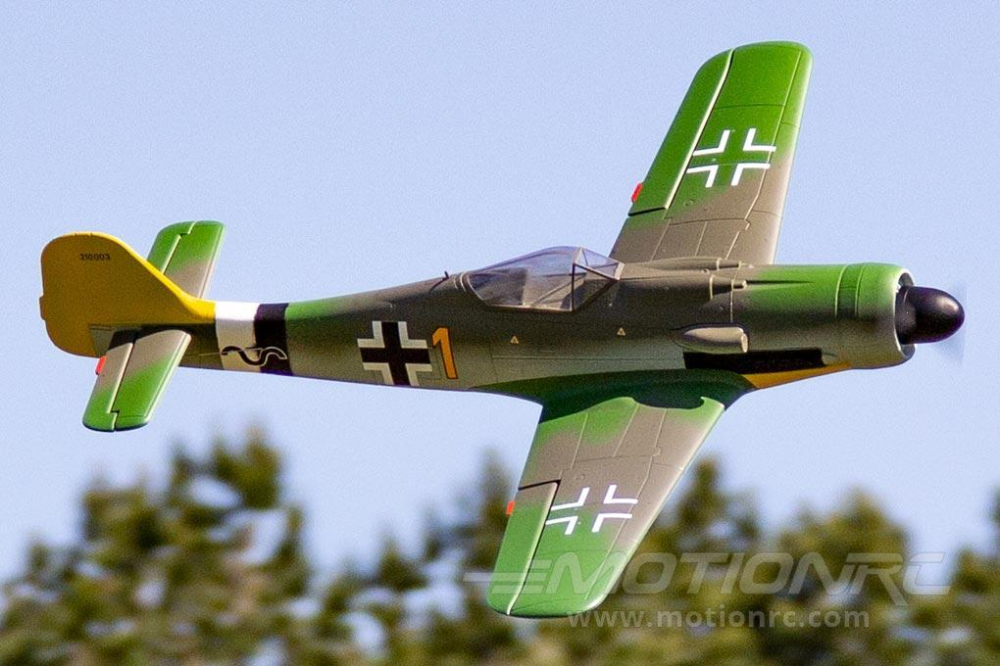
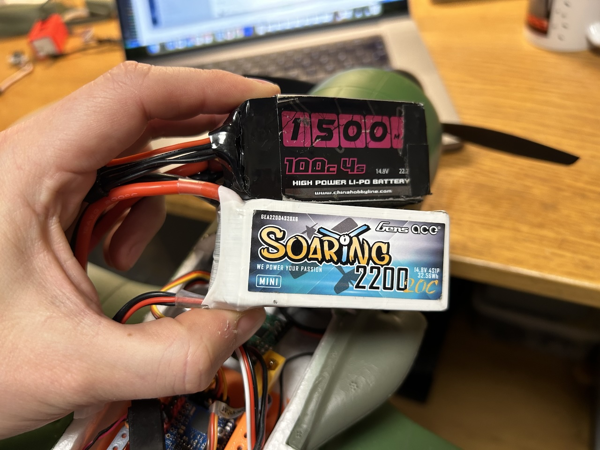

### Parts
- Frame (assembled with servos, esc and motor): [FlightLine Fw 190 D-9 Dora, 850mm](https://www.motionrc.eu/products/flightline-fw-190-d-9-dora-850mm-33-wingspan-pnp-flw102p);
- Receiver: compatible with your system, I use [FrSky Archer Plus R6](https://www.elefun.se/p/prod.aspx?v=59956);
- Battery: Any cheap 1500-2200mAh 4S drone battery.

### Assembly

No special instructions needed here.

### Use

Fly LOS, enjoy the model!

## Step 1: Use Drone motor and Flight Controller (optional)

This step is optional, but recommended.  
Flight controller's main feature I use is auto-launch.  
Crashes and bad landings do happen in FPV combats, drone motors and props usually survive such events w/o any damage, while regular plane motors often end up with a bend shaft.

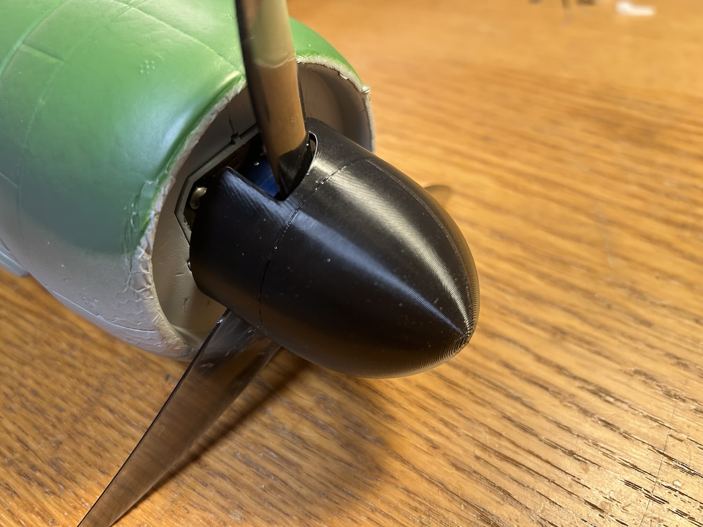
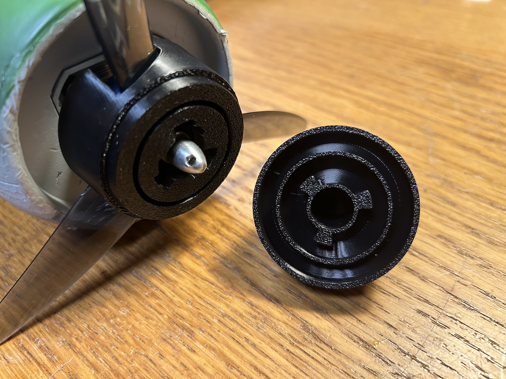
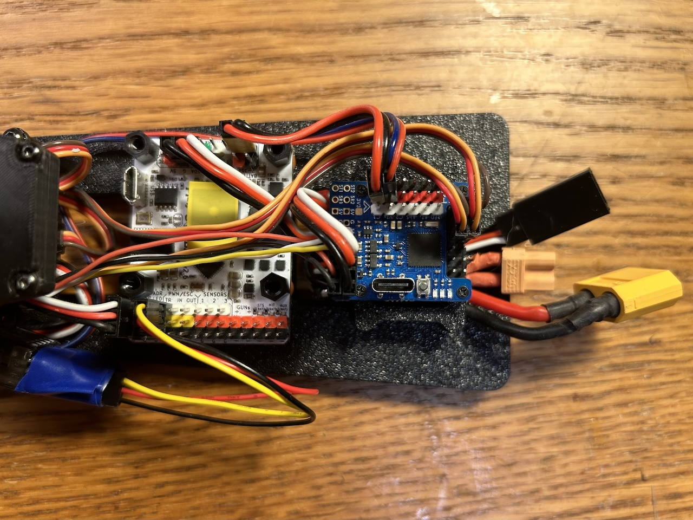

### Parts
- Motor: Any drone motor for 6s (1300-1700kv), for example [Emax ECO II Series 2807](https://droneit.se/product/emax-eco-ii-series-2807-3-6s/)
- Propeller: Any 7-8inch 3-blade 4-6 pitch drone propeller, for example: [Gemfan Cinelifter 8040-3](https://droneit.se/product/gemfan-cinelifter-8040-3-for-cinelifter-freestyle/)
- Spinner: 3D printed in black PLA, see STL folder.
- ESC: Either re-use stock ESC or replace it with some 35-45A drone ESC (compact), for example [Aikon AK32 35A 2-6S](https://www.elefun.se/p/prod.aspx?v=40585)
- Flight Controller
  - [Matek F411-WTE](https://www.mateksys.com/?portfolio=f411-wte) ( [Buy](https://www.elefun.se/p/prod.aspx?v=56505) )
  - [SpeedyBee F405 WING MINI](https://www.speedybee.com/speedybee-f405-wing-mini-fixed-wing-flight-controller/) ( [Buy1](https://droneit.se/product/speedybee-f405-wing-mini-easy-fly-fixed-wing-flight-controller/), [Buy2](https://www.elefun.se/p/prod.aspx?v=63418) )
- Base: 3D printed base to mount electronics to, see "stl" folder;
- FC mount: 3D printed FC mount, see "Rail System" project's "stl" folder;

### Assembly

1. Prepare all necessary 3D printed parts;
2. Remove stock motor, replace with a drone motor, connected to ESC of choice;
3. Spinner and propeller
   1. Install propeller on motor;
   2. Put spinner's lower part on prop;
   3. Tighten with a regular plane prop nut (use a screwdriver or some other metal rod to tighten properly), _not a drone nut with plastic insert -- will not work_!
   4. Place upper spinner part on lower spinner part, and tighten.
4. Remove plywood braket inside the fuselage, we do not need it;
5. Solder servo pins and ESC and battery connectors to the flight controller;
6. Install flight controller on 3D printed base with help of 3D printed brackets;
7. Put the base with FC into fuselage;
8. Connect ESC, servos and receiver;
9. Flash INAV to FC and configure it (see FC folder for INAV dumps) -- you can use DSHOT protocol only with drone ESC!

### Use

- Arm and throw the model, autolaunch shall engage and keep your model in the air until you move right stick.

## Step 2: Add FPV camera with Head tracking

Enhance your experience, feel like you sit in the cockpit!  

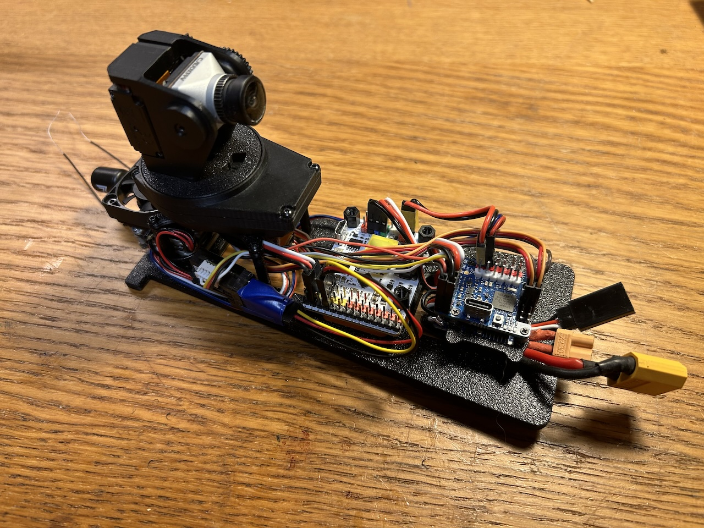
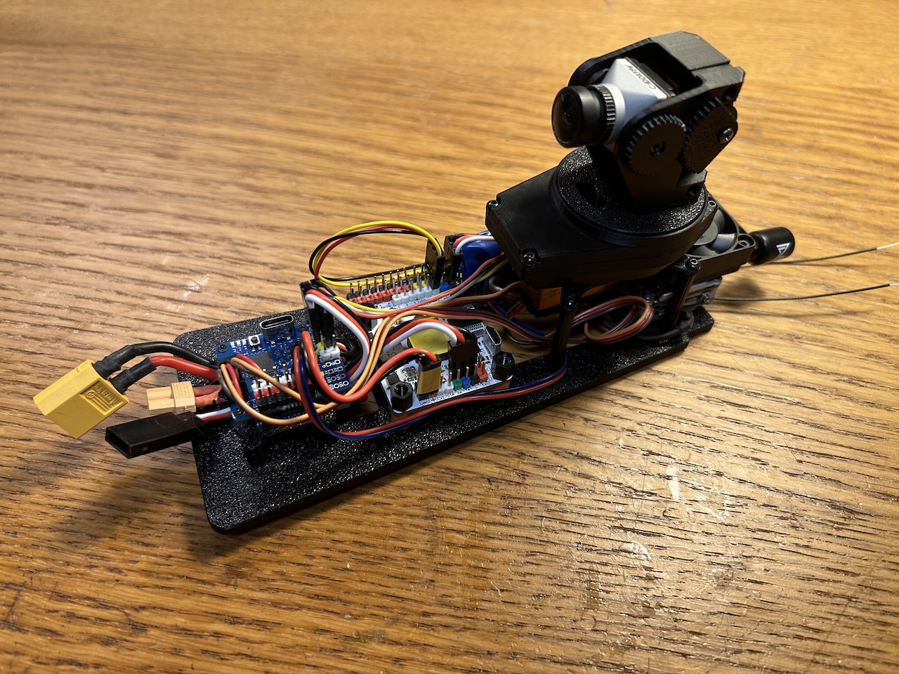
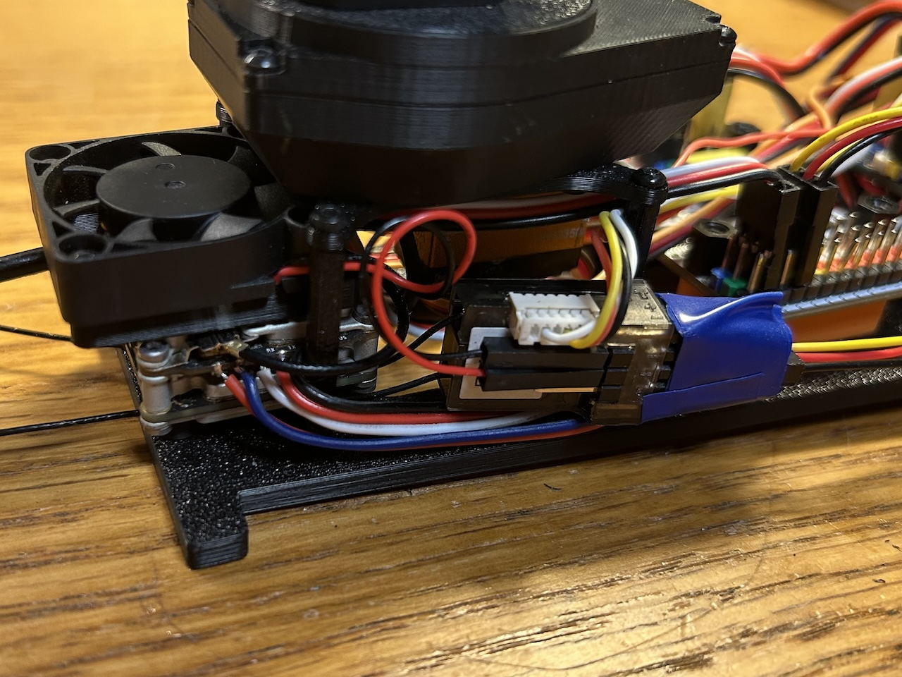
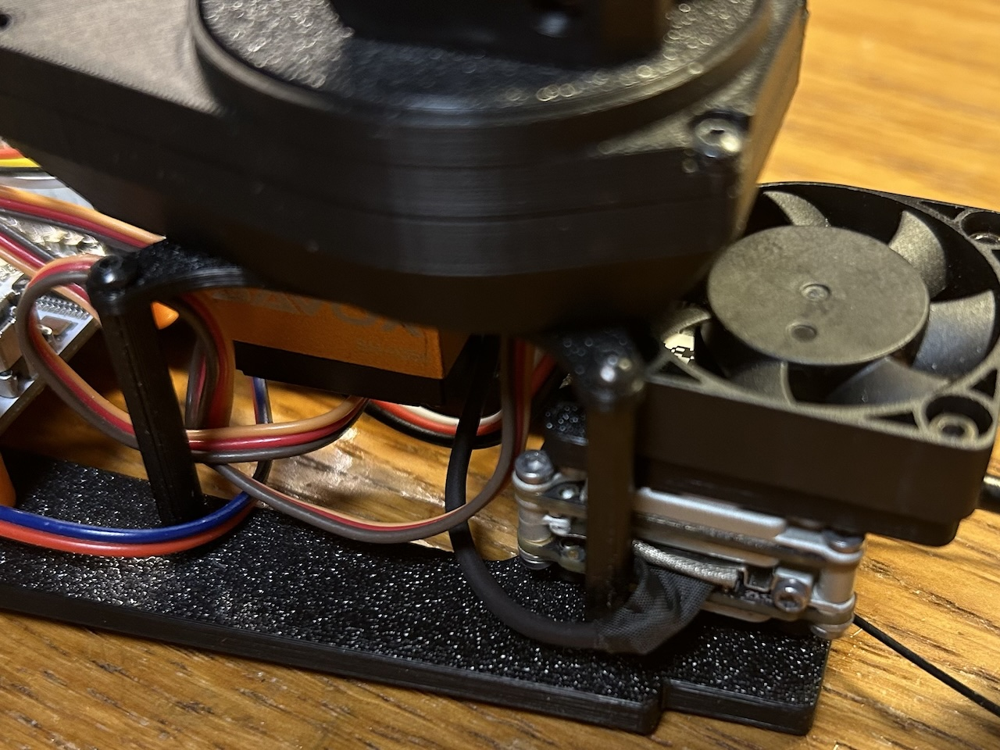

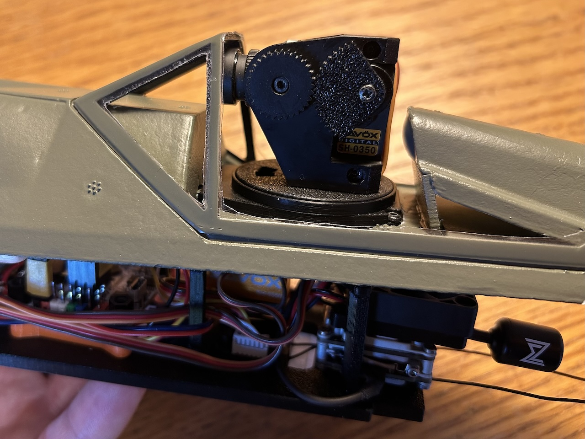
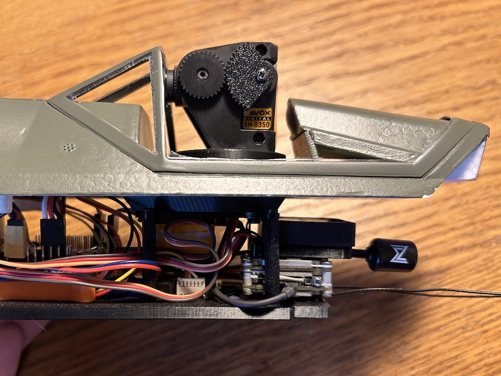
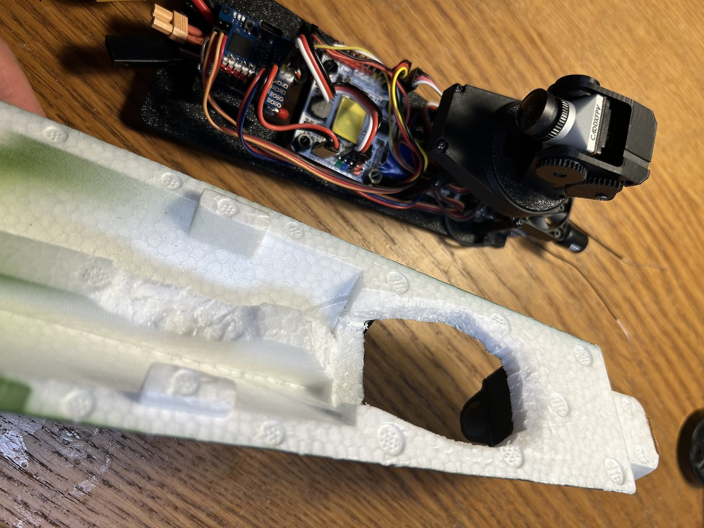

### Parts
- Digital video system: one of DJI, Walksnail or HDZero;  
  _I use [Vista](https://www.elefun.se/p/prod.aspx?v=62406) air unit for the rest of this build guide_
- Camera gimbal: 3D printed and assembled [Micro Camera Gimbal](https://cults3d.com/en/3d-model/gadget/micro-camera-gimbal-ysoldak);  
  _you'll need two high performance micro servos, such as Savöx SH-0350, TowerPro MG90S or Emax ES08MDII_
- [Head tracking](https://github.com/ysoldak/HeadTracker) system;  
  _or just use your radio's potentiometers_
- Standoffs for camera gimbal: 3D printed, 27mm;  
  _alternatively, combination of 19mm and 8mm metal standoffs_
-  standoffs for air unit: 3D printed, 2mm;
- Cooler fan for air unit: 5v 30x30 cooler fan to prevent air unit overheating inside fuselage;
- Cooler fan mount: 3D printed;
- Cockpit frame (optional): 3D printed;
- M2 bolts varous length.

### Assembly

1. Prepare camera gimbal, connect camera to the air unit;
2. Use four M2x18 bolts to secure air unit to the base;  
   _2mm standoffs go under and fan mount above the air unit_
3. Attach 5v cooler fan on top of air unit;  
   _tip: air unit antenna can go between air unit and the fan_
4. Attach camera gimbal to the base on 27mm standoffs;
5. Connect gimbal servos to flight controller;
6. Connect air unit's MSP cable to flight controller (RX, TX and GND pins);
7. Power air unit from flight controller VBAT pins;
8. Power cooler fan with 5v sourced from either receiver or flight controller;
9. Cut out transparent plastic from cockpit, leaving frame intact;
10. Optionally, insert 3D printed cockpit into frame to reinforce it;
10. Carve foam from cockpit to fit camera gimbal and to clear wires comming from the flight controller.

## Step 3: Add FPV Combat system

Time to add FPV Combat system.

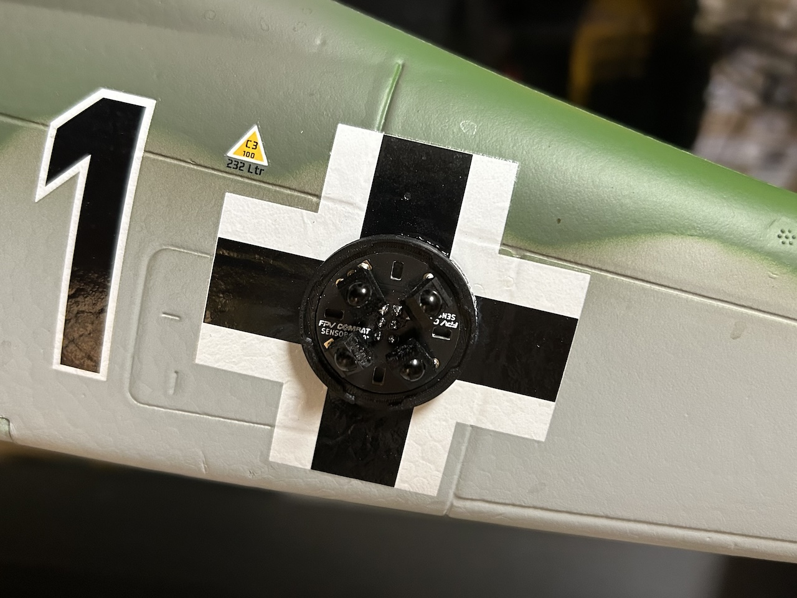
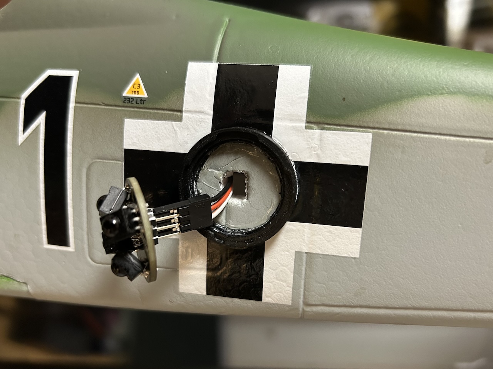

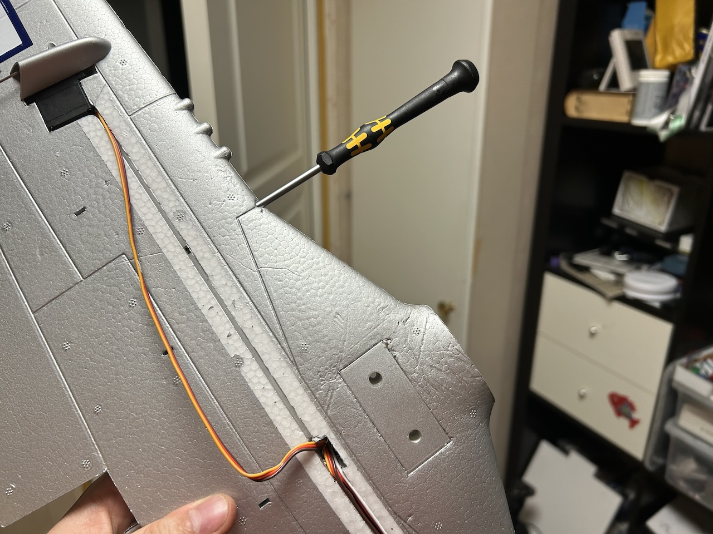
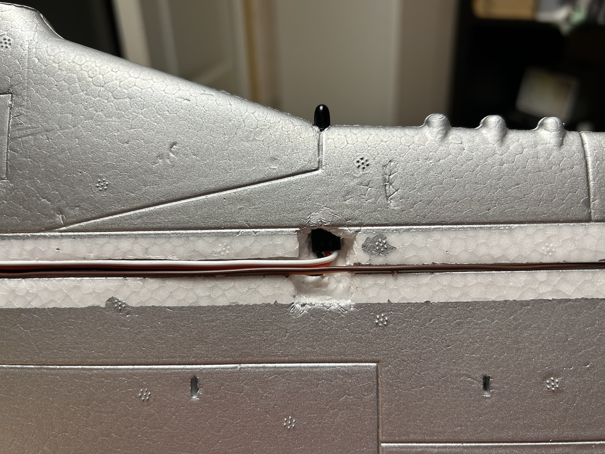
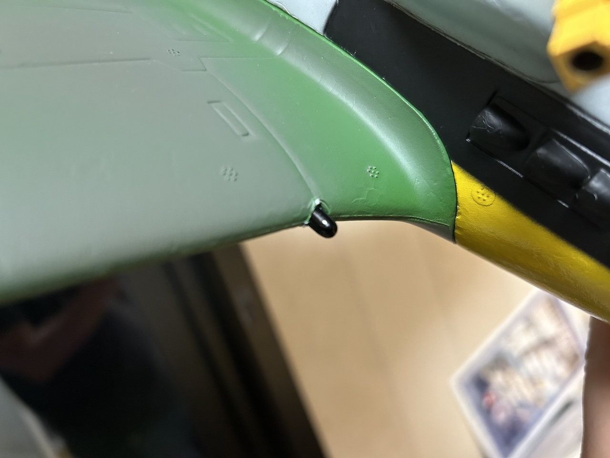
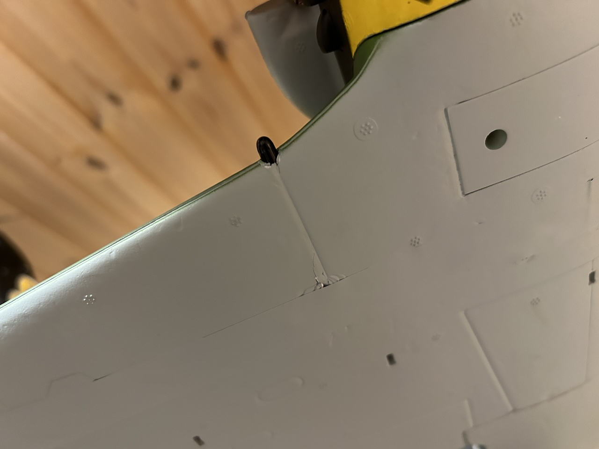

### Parts
- [FPV Combat board](https://fpv-combat.com/);
- Infrared guns: 2 pieces;
- Infrared sensors: 2 pieces;
- HC-12 board;
- Combat board mount: 3D printed, see "Rail System" project's "stl" folder;
- Sensor holders (optional): 3D printed, see "FPV Combat" project's "stl" folder;

### Assembly
- Secure combat board to the base via 3D printed mounts, the board shall be centered;
- Glue sensor holders to each side of fuselage, roughly between wings and tail;  
  _alternatively you can always glue sensors to fuselage directly_
- Cut foam under the sensor holders;
- With help of included wires, connect sensors to the combat board and secure sensors in place;
- Make holes in foam of each wing, 4mm diameter, going from leading edge to servo canal;  
  _use a screwdriver, works great_
- Carefully pick foam from inside the wings, around the holes, making space for infrared guns;
- Connect guns to servo wires and insert them all way into wings from servo canal's side, so the gun domes sticks out the leading edge of the wings;
- Connect guns to the combat board;
- Connect HC-12 board to the combat board;
- Connect a servo output either from flight controller or directly from receiver to the trigger pin of the combat board;
- Connect air unit's RX/TX wires to combat board's MSP pins;  
  _it is possible to add flight controller's OSD, this requires moving HC-12 board to I2C pins and connecting FC MSP to combat board's HC-12 pins_  
- See [wiring diagrams on fpv combat wiki](https://github.com/FPV-Combat/Main_board_v2/wiki/Wiring-diagrams-for-V2.6)
- Power combat board from flight controller's VBAT or battery directly.

### Use

Please see [FPV Combat web site](https://fpv-combat.com) and [wiki](https://github.com/FPV-Combat/Main_board_v2/wiki) for information how to configure and use the system.
